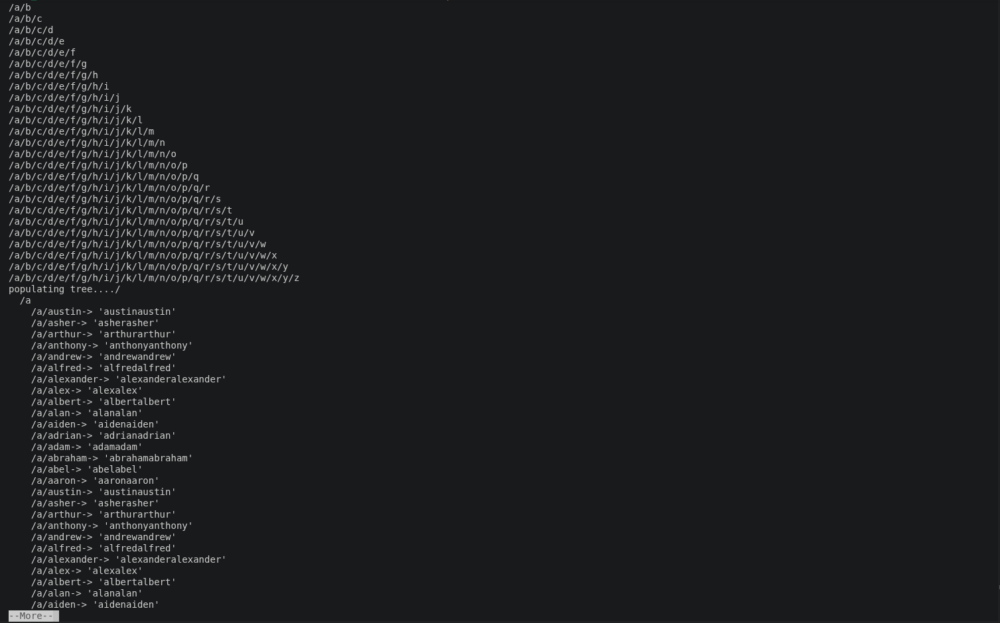
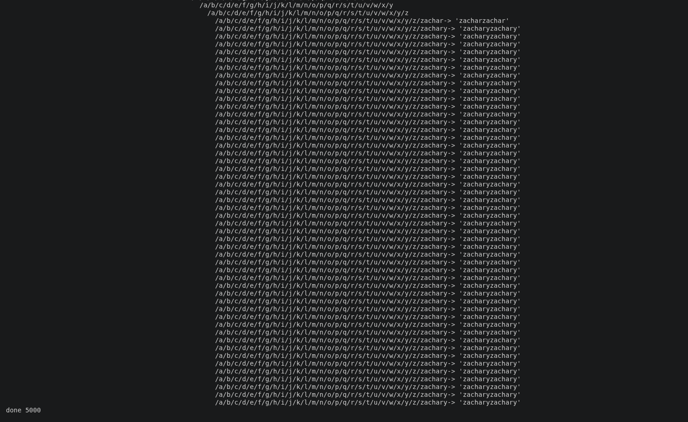

# Tree

A C implementation of a tagged, union-based tree data structure, where each **node** represents a path segment and can hold one or more **leaves** as key-value pairs. Built as a low-level exploration of manual memory management, tagged unions, and pointer-based tree traversal in C.

> **Note:** This is version 1 — a proof-of-concept written to understand the underlying concepts (tagged unions, linked traversal, manual `malloc`/pointer management) rather than a finished tool. It does not accept user input; it runs on a hardcoded example dataset defined at compile time.

## Screenshots

<p align="center">
  
  
</p>


## How It Works

- The tree is built from a single `union` type (`Tree`), which can represent either a `Node` or a `Leaf`, distinguished by a `Tag` field (`TagRoot`, `TagNode`, `TagLeaf`).
- Each `Node` represents a path (e.g. `/a/b/c`) and points to its parent (`north`), its next sibling node (`west`), and its first attached leaf (`east`).
- Each `Leaf` represents a key-value pair attached to a node, linked to sibling leaves via `east`.
- `example_tree()` programmatically builds a chain of nodes representing paths `/a` through `/z`.
- `example_leaves()` reads line-delimited data from a hardcoded input file (`wl.txt`) and attaches each entry as a leaf to its corresponding node.
- `print_tree()` walks the resulting structure and writes an indented, human-readable representation to a file descriptor.

## Build & Run

```bash
gcc -o tree tree.c
./tree | more
```

Requires a `wl.txt` file in the working directory, formatted as one single character per line (matching the `/a`–`/z` node paths created by `example_tree()`).

## Project Status

This is an early, learning-focused version:

- No user-facing input or CLI arguments — data is fixed at compile time via `example_tree()` and the hardcoded `wl.txt` path.
- Node and leaf lookup use simple linear search (`find_node_linear`, `find_leaf_linear`), not optimized for scale.
- Intended primarily as a hands-on exercise in C data structures, memory layout, and pointer manipulation.
- **Known issue:** the wordlist (`wl.txt`) used to populate leaf values is not generated cleanly — it currently contains multiple repeated names, which affects the accuracy of the example output. This is a known limitation of the current data generation step, not the tree logic itself.

## Built With

- C
